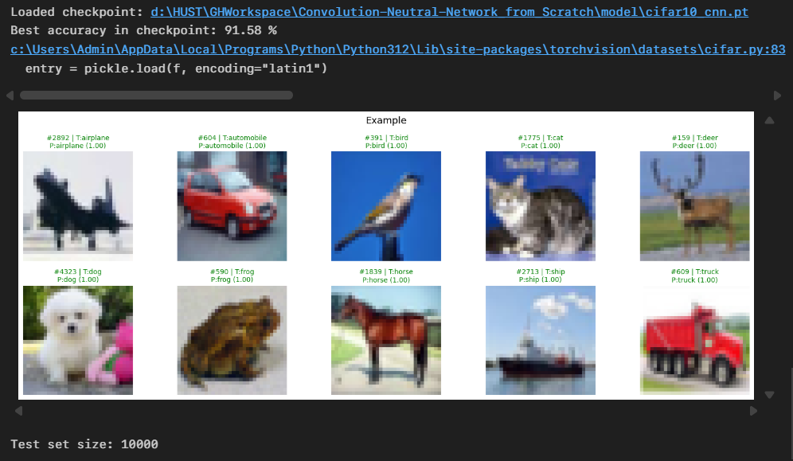

# Convolutional Neural Networks from First Principles (CIFAR-10)

This repository studies CNNs in two complementary ways:

1. **Analytical / educational view** (NumPy, manual backprop) in [src](src)
2. **Computational / practical view** (PyTorch checkpoint inference) in [notebooks/predict_cifar10.ipynb](notebooks/predict_cifar10.ipynb)

The idea is simple: understand the math deeply, then use an optimized stack for fast experimentation.

---
## Demo

---

## Theoretical Motivation

A convolutional network is a function approximation pipeline that maps an image $x$ to class probabilities $p(y\mid x)$.

At a high level:

1. **Convolution** learns local pattern detectors (edges, textures, shapes)
2. **Nonlinearity** (ReLU) increases expressive power
3. **Pooling / downsampling** trades spatial resolution for invariance
4. **Dense classifier** maps learned features to logits
5. **Softmax + cross-entropy** defines the training objective

For one layer, the core operation is:

$$
z = W * x + b, \quad a = \phi(z)
$$

And for classification:

$$
\mathcal{L} = -\sum_{c=1}^{C} y_c \log \hat{y}_c
$$

where $\hat{y}=\text{softmax}(\text{logits})$.

---

## What This Repository Contains

- [src](src): CNN components built manually (`Conv2D`, pooling, flatten, dense, activations, loss, optimizer)
- [data](data): CIFAR-10 data files
- [model/cifar10_cnn.pt](model/cifar10_cnn.pt): trained **PyTorch** checkpoint used for prediction
- [notebooks/predict_cifar10.ipynb](notebooks/predict_cifar10.ipynb): inference notebook (loads checkpoint, evaluates, visualizes)
- [note/NOTE.md](note/NOTE.md): detailed learning notes and progress log

---

## Methodological Split

### A) From-scratch path (for understanding)
- Explicit forward/backward logic in NumPy
- Useful for verifying gradient flow and tensor shapes
- Best for learning internals, not for high-speed training

### B) PyTorch path (for performance)
- GPU-accelerated training/inference
- Practical for reaching stronger CIFAR-10 results quickly
- Checkpoint currently used by notebook: `model/cifar10_cnn.pt`

> Note: PyTorch checkpoints (`model_state`, `optimizer_state`, etc.) are not the same format as NumPy scratch checkpoints.

---

## Experimental Snapshot

- CUDA-enabled environment validated
- Best reported test accuracy during training: **91.58%**

---

## How to Run Inference

1. Open [notebooks/predict_cifar10.ipynb](notebooks/predict_cifar10.ipynb)
2. Run cells from top to bottom
3. The notebook will:
   - load `model/cifar10_cnn.pt`
   - evaluate accuracy
   - show sample predictions with ground-truth labels

---

## Environment

- Python 3.12
- PyTorch (CUDA build)
- torchvision
- numpy
- matplotlib

---

## Project Goal

Build intuition for CNN mechanics from first principles, then bridge that understanding to practical, high-performance inference workflows.

## License
This project use CC-BY-SA 4.0 license.
